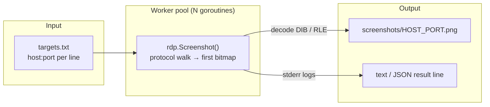
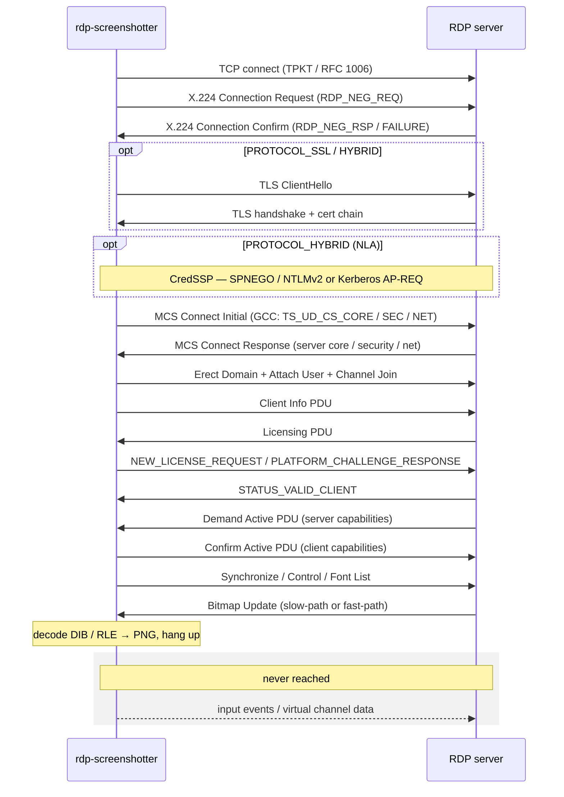
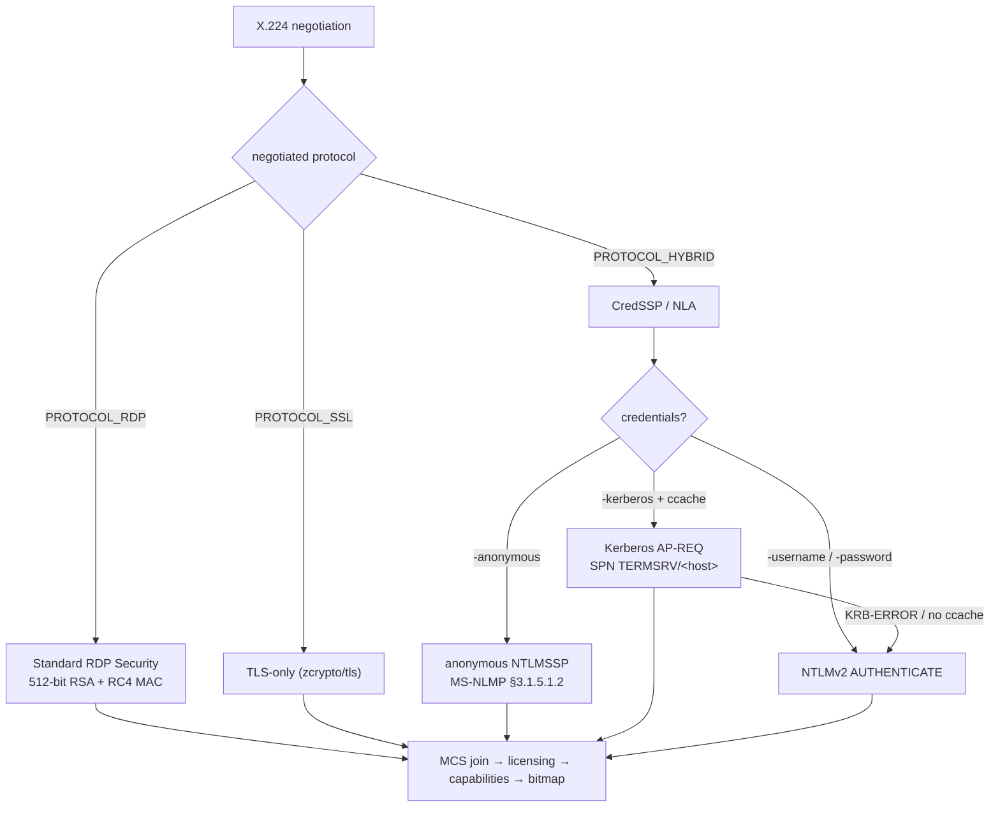

# rdp-screenshotter // rdp handshake → png

Pure-Go RDP client with one job: walk the protocol to the first server bitmap and dump it to a PNG. No cgo, no FreeRDP shell-out, no X server.

[](https://github.com/x-stp/rdp-screenshotter-go/actions/workflows/ci.yml)
[](https://opensource.org/licenses/MPL-2.0)

## what it does

`rdp-screenshotter` opens an RDP connection, drives the handshake all the way to the first server bitmap update, decodes it to a PNG, and hangs up. It never negotiates input, sound, clipboard, or a full session — it grabs the frame and gets out.

Against a fresh Shodan `port:3389 has_screenshot:true` slice, restricted to hosts that negotiate without NLA, it captures roughly **86%** — Server 2008 through Server 2022, Windows 10/11. Standard RDP Security, TLS-only, and modern Server 2012R2+ all work; NLA-gated hosts work when you supply `-username` / `-password` / `-domain` (NTLMv2, or `-kerberos` for an AP-REQ from your credential cache).



## install

```bash
go install github.com/x-stp/rdp-screenshotter-go/cmd/rdp-screenshotter@latest
```

Or build from source:

```bash
make build   # or: go build ./...
```

## usage

Shoot a list of targets, 8 workers:

```bash
echo 1.2.3.4:3389 > targets.txt
rdp-screenshotter -targets targets.txt -workers 8 -output screenshots/
```

NLA-gated hosts with credentials:

```bash
rdp-screenshotter -targets targets.txt -username admin -password 's3cr3t' -domain CORP
```

Kerberos (populate the ccache with `kinit` first — falls back to NTLM on any failure):

```bash
kinit admin@CORP.LOCAL
rdp-screenshotter -targets targets.txt -kerberos -domain CORP.LOCAL
```

Paint the lock screen on NLA-required Windows (the Shodan trick):

```bash
rdp-screenshotter -targets targets.txt -anonymous
```

Machine-readable results into `jq`:

```bash
rdp-screenshotter -targets targets.txt -output-format json | jq -c 'select(.status=="ok")'
```

## flags

| flag | default | description |
|------|---------|-------------|
| `-targets` | `target.txt` | file with one `host[:port]` per line (`#` comments allowed) |
| `-output` | `screenshots` | directory to drop PNGs into (created if missing) |
| `-workers` | `5` | concurrent connections |
| `-timeout` | `10s` | per-connection wall budget (hard cap is 3×) |
| `-username` | | RDP cookie / NLA username |
| `-password` | | NLA password (enables HYBRID negotiation) |
| `-domain` | | NLA / Kerberos realm |
| `-anonymous` | `false` | force PROTOCOL_HYBRID + anonymous CredSSP/NTLMSSP |
| `-kerberos` | `false` | advertise Kerberos V5 in CredSSP, fall back to NTLM |
| `-krb5-ccache` | `$KRB5CCNAME` | Kerberos credential cache path |
| `-krb5-config` | `$KRB5_CONFIG` | `krb5.conf` path |
| `-log-level` | `warn` | `trace\|debug\|info\|warn\|error` |
| `-output-format` | `text` | per-target result lines: `text\|json` |

Per-target result lines go to **stdout**; protocol logs (structured zerolog) go to **stderr** at the level you pick. Pipe stdout to a file, leave stderr on the terminal. No single host can pin a worker — each target is capped at 3× `-timeout` by a watchdog that closes the connection on expiry.

## how it works

| technique | what it does |
|-----------|--------------|
| early bailout | stops at the first bitmap update; never negotiates input, sound, or a full session |
| coherent `TS_UD_CS_CORE` | emits color-depth / capability fields modern Server 2012R2+ accept — they RST otherwise |
| neg-failure retry | on `RDP_NEG_FAILURE`, retries the X.224 request with a downgraded protocol set |
| CredSSP fallback | Kerberos AP-REQ → NTLMv2 → anonymous, transparently, in one code path |
| 512-bit RSA | works around Go's `crypto/rsa` minimum-key guard — Standard Security exchange keys are 512-bit ([MS-RDPBCGR] §5.3.4) |
| RLE decode | decompresses MS-RDPBCGR RLE bitmaps; 15/16/24/32 bpp bottom-up DIB row flip |
| watchdog | 3× `-timeout` hard cap per target so a slow host can't wedge a worker |

> Getting the modern-server tier working hinged on a coherent `TS_UD_CS_CORE` ([MS-RDPBCGR] §2.2.1.3.2): Server 2012R2+ RST the connection right after MCS Connect Initial if the color-depth / capability fields don't line up, where Server 2008 accepts almost anything.

## the connection sequence

The walk from open socket to first frame. Everything after the bitmap update — input, virtual channels, session teardown — is never reached.



## negotiation & auth

The security protocol is chosen in the X.224 exchange, then the CredSSP sub-negotiation picks a credential type. `-anonymous` forces HYBRID; `-kerberos` prefers an AP-REQ but degrades gracefully.



**`-anonymous`** is what Shodan and friends use to paint the lock screen on NLA-required Windows. It runs the CredSSP/NTLMSSP exchange with the [MS-NLMP] §3.1.5.1.2 anonymous `AUTHENTICATE_MESSAGE` (1-byte `0x00` LmChallengeResponse, empty NtChallengeResponse, zero session key); if the server's GINA renders the lock screen before tearing down the channel, you get a one-shot capture. **Trade-off:** forcing HYBRID into the NegReq makes modern hosts that would have answered `PROTOCOL_RDP` / `PROTOCOL_SSL` pick HYBRID instead, and most of them have NTLM disabled at the SSPI layer (`SEC_E_INVALID_TOKEN`), so the captured-host count drops. Use it when you specifically want NLA-gated targets and don't mind losing the legacy-NLA-off ones in the same run.

**`-kerberos`** runs CredSSP with an RFC 4121 GSS-Kerberos AP-REQ (SPN `TERMSRV/<host>`) built from your credential cache — populate it with `kinit` first. Any Kerberos failure (no ccache, KDC unreachable, `KRB-ERROR`) transparently falls back to the NTLM path, so the flag is safe to leave on for mixed AD / standalone runs.

## library

The whole thing is usable as a library:

```go
package main

import (
    "fmt"
    "os"
    "time"

    "github.com/rs/zerolog"
    "github.com/x-stp/rdp-screenshotter-go/pkg/rdp"
)

func main() {
    rdp.SetLogLevel(zerolog.InfoLevel)

    client, err := rdp.NewClient("1.2.3.4:3389", &rdp.ClientOptions{
        Timeout: 15 * time.Second,
    })
    if err != nil {
        panic(err)
    }
    defer client.Close()

    png, err := client.Screenshot()
    if err != nil {
        panic(err)
    }
    _ = os.WriteFile("shot.png", png, 0o644)
    fmt.Printf("captured %d bytes\n", len(png))
}
```

`rdp.SetLogger`, `rdp.SetLogOutput`, and `rdp.SetLogLevel` are the only logging knobs the library exposes — `rdp.SetLogger(zerolog.Nop())` silences it entirely.

## protocol coverage

| feature | status |
|---------|--------|
| X.224 negotiation + `RDP_NEG_FAILURE` retry | ✅ works |
| Modern-server MCS activation (Server 2012R2 .. 2022, Win10/11) | ✅ works |
| Deactivate-All / reactivation sequence | ✅ works |
| Standard RDP security (RC4, 40/56/128-bit) | ✅ works |
| Server X.509 chain + proprietary cert | ✅ works |
| TLS-only transport | ✅ works |
| NLA / CredSSP via NTLMv2 + SPNEGO | ✅ works |
| Kerberos via CredSSP (AP-REQ, NTLM fallback) | ✅ works |
| Full RDP licensing (`NEW_LICENSE_REQUEST`, `PLATFORM_CHALLENGE_RESPONSE`) | ✅ works |
| Slow-path bitmap updates (15/16/24/32 bpp) | ✅ works |
| Fast-path output PDUs | ✅ works |
| Bitmap RLE decompression | ✅ works |
| RemoteFX / Graphics Pipeline (RDPGFX) | ❌ not implemented |
| Dynamic virtual channels | ❌ not implemented |

## project layout

```
cmd/rdp-screenshotter/   concurrent CLI worker pool around pkg/rdp
cmd/credssp-test/        single-target NLA diagnostic harness
pkg/rdp/                 RDP protocol implementation
  client.go              Client + ClientOptions, Screenshot() orchestration
  connect.go             X.224 + TLS + CredSSP handshake, MCS join, Client Info
  secure.go              Standard RDP MAC + RC4 wrap, basic security header
  read.go                slow/fast-path receive, reactivation, bitmap compositing
  log.go                 package zerolog.Logger + level helpers
  tpkt.go                RFC 1006 packet framing
  x224.go                ITU-T X.224 connection negotiation + neg-failure retry
  mcs.go                 T.125 MCS channel management, GCC client/server data
  per/per.go             ITU-T X.691 PER primitives (+ round-trip tests)
  security.go            session key derivation, raw-RSA exchange, MAC, RC4
  credssp.go             CredSSP/NLA orchestration: TSRequest, SPNEGO (MS-CSSP)
  ntlm.go                NTLMv2 negotiate/authenticate/seal (MS-NLMP)
  kerberos.go            GSS-Kerberos AP-REQ via gokrb5 (RFC 4121 in MS-CSSP)
  spnego.go              SPNEGO token wrapping (RFC 4178)
  pdu.go                 share control / share data PDU builders + parsers
  capabilities.go        Confirm Active capability negotiation
  licensing.go           licensing PDU dispatch + STATUS_VALID_CLIENT alert
  license_protocol.go    NEW_LICENSE_REQUEST / PLATFORM_CHALLENGE_RESPONSE (MS-RDPELE)
  tls.go                 TLS upgrade via zcrypto/tls
pkg/bitmap/              bitmap pixel decoders
  bitmap.go              15/16/24/32 bpp → PNG, bottom-up DIB row flip
  rle.go                 RDP RLE bitmap decompressor (MS-RDPBCGR §3.1.9)
```

## specifications

- [MS-RDPBCGR](https://learn.microsoft.com/en-us/openspecs/windows_protocols/ms-rdpbcgr/) — RDP Basic Connectivity & Graphics Remoting
- [MS-RDPELE](https://learn.microsoft.com/en-us/openspecs/windows_protocols/ms-rdpele/) — RDP Licensing Extension
- [MS-CSSP](https://learn.microsoft.com/en-us/openspecs/windows_protocols/ms-cssp/) — CredSSP
- [MS-NLMP](https://learn.microsoft.com/en-us/openspecs/windows_protocols/ms-nlmp/) — NTLM
- [ITU-T T.125](https://www.itu.int/rec/T-REC-T.125) / [T.124](https://www.itu.int/rec/T-REC-T.124) — MCS / GCC
- [ITU-T X.224](https://www.itu.int/rec/T-REC-X.224) / [X.691](https://www.itu.int/rec/T-REC-X.691) — COTP / PER
- [RFC 1006](https://www.rfc-editor.org/rfc/rfc1006) — TPKT over TCP
- [RFC 4178](https://www.rfc-editor.org/rfc/rfc4178) (SPNEGO) / [RFC 4121](https://www.rfc-editor.org/rfc/rfc4121) (GSS-Kerberos)
- [RFC 5246](https://www.rfc-editor.org/rfc/rfc5246) (TLS 1.2) / [RFC 6066](https://www.rfc-editor.org/rfc/rfc6066) (SNI)

## building / testing

```bash
make build      # or: go build ./...
make test       # go test -race ./...
make lint       # go vet + golangci-lint (config in .golangci.yml)
```

Requires Go 1.25+. See [TODO.md](TODO.md) for known limitations and the next slice of work.

## funding

If this tool is useful to you:

- [ko-fi.com/securetheplanet](https://ko-fi.com/securetheplanet)
- [buymeacoffee.com/xstp](https://buymeacoffee.com/xstp)
- [github.com/sponsors/xstp](https://github.com/sponsors/xstp)

## license

MPL-2.0 — see [LICENSE](LICENSE).
